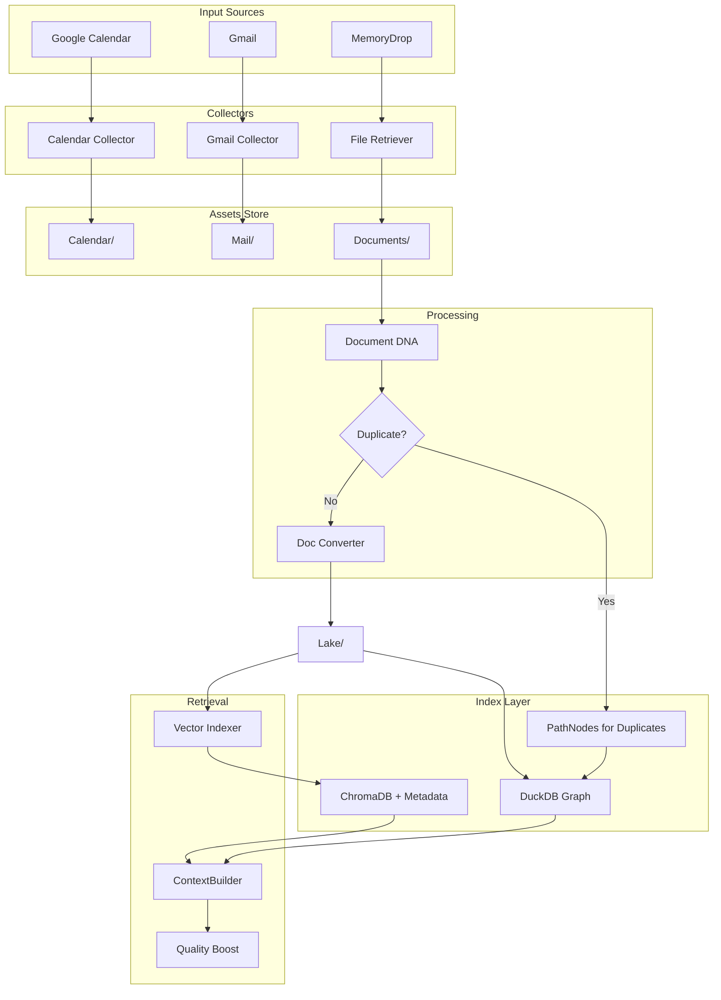

# Context-Awareness & Integration Upgrade

## Phase 1: Dependencies & Configuration

### 1.1 Update [requirements.txt](requirements.txt)

```
# Google API
google-auth-oauthlib
google-api-python-client

# Document DNA - Deep Metadata Extraction
python-magic          # MIME type detection via libmagic
langdetect            # Language detection
Pillow                # Image metadata (dimensions, DPI)
```

### 1.2 Update [config/my_mem_config.yaml](config/my_mem_config.yaml)

Add new paths and quality boost config:

```yaml
paths:
  asset_calendar: "~/MyMemory/Assets/Calendar"
  asset_mail: "~/MyMemory/Assets/Mail"

google:
  credentials_path: "~/MyMemory/credentials/client_secret.json"
  token_path: "~/MyMemory/credentials/token.json"
  scopes:
    - "https://www.googleapis.com/auth/calendar.readonly"
    - "https://www.googleapis.com/auth/gmail.readonly"
  calendar:
    calendar_ids: ["primary"]
    history_days: 7
    future_days: 14
  gmail:
    target_label: "MyMem"
    history_days: 7

# Quality-Aware Reranking (NEW)
reranking:
  quality_boost:
    authoring_tools: 0.15    # Boost for Word, Excel, PowerPoint originals
    scanner_penalty: -0.10   # Penalty for scanned/OCR documents
    density_boost_per_sheet: 0.02  # Per Excel sheet
```

---

## Phase 2: Document DNA Module (Metadata is Queen)

### 2.1 Create [services/utils/document_dna.py](services/utils/document_dna.py)

#### Output Structure:

```python
{
    "file_dna": {
        "file_hash_sha256": "abc123...",
        "file_size_bytes": 1048576,
        "mime_type_detected": "application/pdf",
        "extension_normalized": ".pdf",
        "is_encrypted": False
    },
    "intrinsic": {
        "page_count": 12,
        "author_embedded": "Joakim Ekman",
        "title_embedded": "Årsredovisning 2024",
        "creation_tool": "Microsoft Word",
        "sheet_names": ["Budget 2023", "Q1 Data"],
        "row_count_total": 1543,
        "dimensions": "1920x1080",
        "resolution_dpi": 300
    },
    "content_metrics": {
        "word_count": 4523,
        "character_count": 28456,
        "language_detected": "sv",
        "empty_file": False
    },
    "provenance": {
        "original_filename": "final_v3_print.pdf",
        "absolute_path": "/path/to/file",
        "file_permissions": "0644",
        "last_modified_ts": "2025-12-10T14:32:00+01:00",
        "last_accessed_ts": "2025-12-15T09:15:00+01:00"
    }
}
```

#### Key Functions:

```python
def extract_document_dna(filepath: str) -> dict:
    """Main entry point. Returns full metadata dict."""

def _format_dna_for_llm(dna: dict) -> str:
    """
    Token Economy: Filter DNA for LLM consumption.
    
    INCLUDE: title_embedded, author_embedded, creation_tool, 
             sheet_names, page_count, language_detected
    
    EXCLUDE: file_hash, file_permissions, file_size_bytes,
             absolute_path, character_count
    
    Returns formatted string for prompt injection.
    """

def _hash_file_streaming(filepath: str, chunk_size: int = 8192) -> str:
    """SHA256 without loading entire file into RAM."""

def _classify_creation_tool(tool: str) -> str:
    """
    Classify tool for quality scoring.
    Returns: 'authoring' | 'scanner' | 'distiller' | 'unknown'
    
    authoring: Microsoft Word, Excel, PowerPoint, Google Docs
    scanner: Ricoh, Canon, Xerox, ScanSnap
    distiller: Adobe Distiller, PDF converters
    """
```

---

## Phase 3: Closing the Retrieval Gap

### 3.1 Update [services/my_mem_vector_indexer.py](services/my_mem_vector_indexer.py)

Lift specific DNA fields to ChromaDB metadata for filtering:

```python
# Fields to extract from frontmatter and send to ChromaDB metadatas
CHROMA_METADATA_FIELDS = [
    "author_embedded",     # Filter: "Vad har Joakim skrivit?"
    "creation_tool",       # Filter by quality
    "mime_type_detected",  # Filter: type:spreadsheet
    "language_detected",   # Filter: lang:sv
    "title_embedded",      # Better search hit display
    "tool_classification", # 'authoring' | 'scanner' | 'distiller'
]

def _extract_chroma_metadata(frontmatter: dict) -> dict:
    """Extract DNA fields for ChromaDB metadata argument."""
    doc_meta = frontmatter.get('document_metadata', {})
    return {
        'author': doc_meta.get('intrinsic', {}).get('author_embedded'),
        'creation_tool': doc_meta.get('intrinsic', {}).get('creation_tool'),
        'mime_type': doc_meta.get('file_dna', {}).get('mime_type_detected'),
        'language': doc_meta.get('content_metrics', {}).get('language_detected'),
        'title': doc_meta.get('intrinsic', {}).get('title_embedded'),
        # ... existing fields (timestamp, filename)
    }
```

### 3.2 Update [services/my_mem_graph_builder.py](services/my_mem_graph_builder.py)

Create relationships from embedded metadata:

```python
# In process_lake_batch():

# A. author_embedded -> CREATED_BY -> Person
author = doc_meta.get('intrinsic', {}).get('author_embedded')
if author:
    graph.upsert_node(id=author, type="Entity", 
                      properties={"entity_type": "Person"})
    graph.upsert_edge(source=unit_id, target=author, edge_type="CREATED_BY")

# B. sheet_names -> DEALS_WITH -> Concept (for searchability)
sheet_names = doc_meta.get('intrinsic', {}).get('sheet_names', [])
for sheet in sheet_names:
    # "Budget 2024" -> link to "Budget" concept if exists
    graph.upsert_node(id=sheet, type="Concept")
    graph.upsert_edge(source=unit_id, target=sheet, edge_type="CONTAINS_SHEET")
```

### 3.3 Update [services/context_builder.py](services/context_builder.py) - Quality-Aware Reranking

Extend `_calculate_hybrid_score()`:

```python
def _calculate_hybrid_score(doc, base_score: float, query_date: datetime) -> float:
    """
    Hybrid score = base_score * time_boost * quality_boost
    """
    # Existing time boost
    time_boost = _calculate_time_boost(doc, query_date)
    
    # NEW: Quality boost based on creation_tool
    quality_boost = _calculate_quality_boost(doc)
    
    return base_score * (1 + time_boost) * (1 + quality_boost)

def _calculate_quality_boost(doc) -> float:
    """
    Boost original documents, penalize scanned/OCR.
    
    - Authoring tools (Word, Excel): +15%
    - Scanners (Ricoh, Canon): -10%
    - Excel with many sheets: +2% per sheet (max +10%)
    """
    metadata = doc.get('metadata', {})
    tool = metadata.get('creation_tool', '').lower()
    
    boost = 0.0
    
    # Authoring tool boost
    if any(t in tool for t in ['word', 'excel', 'powerpoint', 'google docs']):
        boost += CONFIG['reranking']['quality_boost']['authoring_tools']
    
    # Scanner penalty
    if any(t in tool for t in ['ricoh', 'canon', 'xerox', 'scanner', 'scan']):
        boost += CONFIG['reranking']['quality_boost']['scanner_penalty']
    
    # Density boost for Excel
    sheet_count = len(metadata.get('sheet_names', []))
    if sheet_count > 1:
        density_boost = min(sheet_count * 0.02, 0.10)  # Cap at 10%
        boost += density_boost
    
    return boost
```

---

## Phase 4: Graph-Based Deduplication

### 4.1 Update [services/my_mem_doc_converter.py](services/my_mem_doc_converter.py)

Instead of skipping duplicates, link them via the graph:

```python
def _handle_duplicate(unit_id: str, file_hash: str, new_path: str) -> bool:
    """
    Graph-based deduplication: Don't discard, link!
    
    If hash exists:
    1. Find the Master Unit (first indexed)
    2. Create PathNode for new location
    3. Link: PathNode -> CONTAINS -> Master_Unit
    4. Update Master Unit's file_locations property
    
    Returns True if duplicate was handled (skip Lake creation)
    """
    graph = _get_graph_store()
    
    # Check if hash exists in any Unit
    existing = graph.find_nodes_by_property("file_hash_sha256", file_hash)
    
    if not existing:
        return False  # Not a duplicate, proceed normally
    
    master_unit = existing[0]
    master_id = master_unit['id']
    
    # Create PathNode for new location
    path_node_id = f"path:{new_path}"
    graph.upsert_node(
        id=path_node_id,
        type="PathNode",
        properties={"path": new_path, "discovered_at": datetime.now().isoformat()}
    )
    
    # Link path to master unit
    graph.upsert_edge(source=path_node_id, target=master_id, edge_type="CONTAINS")
    
    # Update master's file_locations list
    locations = master_unit.get('properties', {}).get('file_locations', [])
    if new_path not in locations:
        locations.append(new_path)
        graph.update_node_property(master_id, "file_locations", locations)
    
    LOGGER.info(f"DUPLICATE: {new_path} linked to master {master_id}")
    print(f"{_ts()} 🔗 DUP: {_kort(os.path.basename(new_path))} → linked to existing")
    
    return True  # Skip Lake creation
```

---

## Phase 5: The Collectors (New Services)

### 5.1 Create [services/my_mem_calendar_collector.py](services/my_mem_calendar_collector.py)

- OAuth via configured credentials
- Fetch events from `history_days` back to `future_days` forward
- Daily Digest with `DATUM_TID`, `participants`
- File: `Calendar_YYYY-MM-DD_[UUID].md `in `Assets/Calendar/`

### 5.2 Create [services/my_mem_gmail_collector.py](services/my_mem_gmail_collector.py)

- Same OAuth flow
- Fetch messages with label "MyMem"
- File: `Mail_YYYY-MM-DD_Subject_[UUID].txt `in `Assets/Mail/`

### 5.3 Update [start_services.py](start_services.py)

```python
{"path": "services/my_mem_calendar_collector.py", "name": "Calendar Collector"},
{"path": "services/my_mem_gmail_collector.py", "name": "Gmail Collector"},
```

---

## Phase 6: Prompt Engineering

### 6.1 Update [config/services_prompts.yaml](config/services_prompts.yaml) - Transcriber

Add `{context_injection}` and expand output:

```yaml
transcriber:
  analysis_prompt: |
    {context_injection}
    
    Du får en rå transkription...
    
    RETURNERA EXAKT DENNA JSON-STRUKTUR:
    {
      ...existing fields...
      "decisions_made": ["Beslut 1", "Beslut 2"],
      "action_items": [
        {"who": "Joakim", "what": "Skicka offert", "deadline": "2025-12-20"}
      ]
    }
```

### 6.2 Update [config/services_prompts.yaml](config/services_prompts.yaml) - DocConverter

Add `{entity_context}`, `{temporal_context}`, `{document_context}`:

```yaml
doc_converter:
  ots_injection_prompt: |
    {entity_context}
    {temporal_context}
    {document_context}
    
    Din uppgift är att strukturera ostrukturerad text...
    
    OUTPUT KRAV:
    {
      ...existing fields...
      "reference_date": "YYYY-MM-DD",
      "decisions_made": ["..."],
      "action_items": [{"who": "...", "what": "...", "deadline": "..."}],
      "information_density": 0.75
    }
```

---

## Phase 7: Context Injection Logic

### 7.1 Update [services/my_mem_transcriber.py](services/my_mem_transcriber.py)

Fuzzy calendar matching with +/- 15 minute overlap:

```python
def _get_calendar_context(file_timestamp: datetime) -> str:
    """
    Find calendar events overlapping with file creation time.
    Uses fuzzy matching: file_time +/- 15 minutes.
    """
    calendar_folder = os.path.expanduser(CONFIG['paths']['asset_calendar'])
    file_date = file_timestamp.date()
    
    # Find digest for this date
    digest_pattern = f"Calendar_{file_date.isoformat()}_"
    for f in os.listdir(calendar_folder):
        if f.startswith(digest_pattern):
            digest_path = os.path.join(calendar_folder, f)
            events = _parse_calendar_digest(digest_path)
            
            # Find overlapping events (+/- 15 min)
            overlapping = []
            for event in events:
                event_start = event['start']
                event_end = event['end']
                
                # Fuzzy window
                window_start = file_timestamp - timedelta(minutes=15)
                window_end = file_timestamp + timedelta(minutes=15)
                
                if event_start <= window_end and event_end >= window_start:
                    overlapping.append(event)
            
            if overlapping:
                event = overlapping[0]  # Best match
                participants = ", ".join(event.get('attendees', []))
                return (
                    f"KONTEXT: Enligt kalendern kan detta vara mötet "
                    f"'{event['summary']}' med deltagarna: {participants}. "
                    f"Använd detta för att identifiera talare om rösterna matchar."
                )
    
    return ""  # No calendar context available
```

### 7.2 Update [services/my_mem_doc_converter.py](services/my_mem_doc_converter.py)

Token-efficient DNA injection:

```python
def generera_metadata(text, filnamn, dna: dict):
    """Generate metadata with context injection."""
    
    # Existing entity context
    entity_context = _build_entity_context()
    
    # Temporal context
    temporal_context = f"REFERENSDATUM: {dna['provenance']['last_modified_ts'][:10]}"
    
    # Document context (token-efficient)
    document_context = _format_dna_for_llm(dna)
    
    # Build prompt with injections
    prompt = raw_prompt.replace("{entity_context}", entity_context)
    prompt = prompt.replace("{temporal_context}", temporal_context)
    prompt = prompt.replace("{document_context}", document_context)
    
    # ... LLM call ...
```

---

## Data Flow Diagram



## Summary: Retrieval Gap Closed

| Gap | Solution |

|-----|----------|

| Metadata stuck in YAML | Vector Indexer lifts to ChromaDB metadata |

| No quality awareness | ContextBuilder boosts authoring tools, penalizes scanners |

| Duplicates discarded | Graph links PathNodes to Master Unit |

| Token waste in prompts | `_format_dna_for_llm()` filters technical fields |

| Fuzzy calendar match | +/- 15 min overlap window |